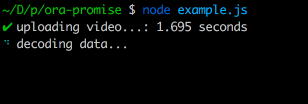

# ora-promise

Use [ora](https://github.com/sindresorhus/ora) to monitor your promises execution time

Some 💅 for your CLI



## install

```sh
npm i ora-promise
```

## usage

```js

const spinner = require('ora-promise');

spinner('generating video...', getSomePromise).then(console.log).catch(console.log)

```

See [./example.js](./example.js)